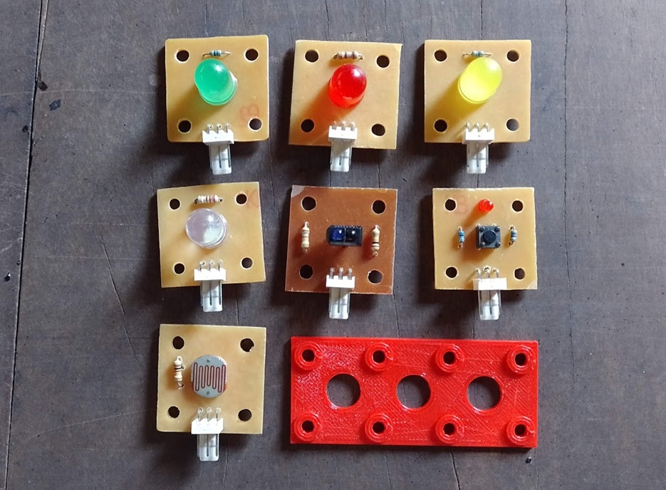

# Módulos 20x20

Este repositorio contiene una colección de módulos electrónicos de 20x20 mm diseñados especialmente para su uso educativo junto a la placa PyTrainer y la plataforma NanoBot.

## 🧩 ¿Qué son los Módulos 20x20?

Los Módulos 20x20 son pequeñas placas electrónicas que siguen un formato cuadrado de 20 mm de lado. Están pensadas para ser:

- Fáciles de montar gracias a su tamaño estandarizado.
- Compatibles con estructuras impresas en 3D con perforaciones espaciadas cada 20 mm.
- Fabricables con técnicas caseras (PCB de una o doble cara, sin componentes SMD).

Estos módulos permiten trabajar conceptos básicos de electrónica y programación de forma práctica, modular y didáctica.

## 🛠️ Módulos disponibles

Cada módulo cuenta con su propia carpeta que incluye:

- Archivos de diseño (Esquemático, PCB).
- Información técnica y de montaje.
- Instrucciones de uso.

Listado actual de módulos incluidos:

- ✅ Módulo LED de 10 mm
- ✅ Módulo con 3 LEDs
- ✅ Módulo con LDR
- ✅ Módulo con LED RGB Neopixel
- ✅ Módulo semáforo (Rojo, Amarillo, Verde)
- ✅ Módulo seguidor de línea
- ✅ Módulo con interruptor

## 🎓 ¿A quién está dirigido?

Este proyecto está pensado para:

- Docentes que deseen implementar actividades prácticas en el aula.
- Estudiantes de nivel medio o inicial en electrónica.
- Makers y entusiastas que busquen una base modular para prototipado.

## 📄 Licencia

Este repositorio se distribuye bajo la licencia [MIT](LICENSE), lo que permite su uso, modificación y redistribución con fines educativos o personales.

---

### ✉️ Contacto

Para sugerencias, mejoras o consultas, podés visitar mi blog: [https://www.profetolocka.com.ar](https://www.profetolocka.com.ar)

